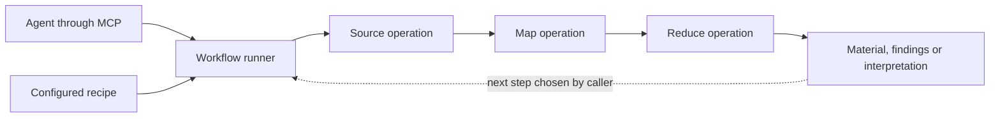

# Composable recall: first contract

Proposal against implementation `c260aed6c352ba2598d18eb258f4aa0ce01e9ee8`.
These are design decisions to test, not capabilities already delivered.
[VISION](VISION.md) supplies the intent; this document defines the first implementation boundary.

## Parts and responsibilities

A **plugin** supplies operations. An **operation** accepts parameters and zero or more named
input streams, and produces a result stream. Source, map and reduce describe how an operation
is used; they do not require three inheritance hierarchies. A reducer may consume many records
before returning one. A model can implement any of these roles.

The **runner** discovers operations, validates connections and parameters, executes the chosen
steps, and records their lineage and outcomes. A **workflow** composes calls. Its next call may
be chosen after inspecting previous results. The first runner executes explicit calls and recipes;
it does not invent a route. A planning model can later propose calls for the caller to execute.

MCP exposes these capabilities to agents. Its readable answers are presentation, not the internal
exchange format. Existing `recent`, `search` and `read` remain usable during migration.

## Operation contract

A plugin exports a catalog and an invocation entry point. Start with in-process Python and
asynchronous streams: a trusted extension API, not a sandbox or a cross-language execution
protocol. Blocking readers can be adapted without rewriting their internals.

| Descriptor | Meaning |
| --- | --- |
| Name and API version | Stable operation identity and implemented contract. |
| Purpose | Short point-of-use description; fuller help available on demand. |
| Parameters | JSON Schema, including defaults. Lines and seconds belong here when applicable. |
| Inputs and output | Named ports with versioned payload schemas. A source may have no inputs. |
| Dependencies | Required configuration or services, availability and usable recovery steps. |

Configuration binds a caller-facing alias to an implementation and its settings. Replacement
preserves declared operation semantics and port contracts, not identical ranking or wording.
Reject incompatible connections before running them. Report unsupported operations explicitly;
plugins need not supply empty methods for capabilities they lack. External plugins import a
small public API, not private core helpers.

Start with exact port-schema compatibility and explicit adapter operations. Similar-looking JSON
objects do not imply semantic compatibility. Introduce concrete payload schemas as operations
need them; the first slice does not require a universal taxonomy of knowledge.

## Records and source references

Records share an envelope while their payloads retain their declared schemas. Text, commits,
audio references and interpretations need not become the same kind of fact. Reference large
or binary material instead of copying it into every record.

| Envelope field | Meaning |
| --- | --- |
| Record ID | Identity within the run, assigned by the runner. |
| Payload | Value or artifact reference described by the output schema. |
| Evidence | References for revisiting the available underlying material. |
| Lineage | Input record IDs and producing operation call; several inputs are possible. |
| Context | Available origin attributes with explicit meanings: actor, event time, capture time, etc. Unknown values may be absent. |

A source reference names a configured source alias, an opaque locator and, when available,
a revision or observation time. A locator can identify a text span, commit or audio interval.
The source reader interprets it; the runner must not assume a filesystem path. A replacement
reader supports its advertised locator contract or reports incompatibility. Old addresses
must not silently acquire different meanings.

Lineage describes the actual output relationship: selected or quoted material, transformed content,
or unknown. A model call does not automatically mean paraphrasing. A transcript links to its audio;
two transcripts share that origin. Summaries may be summarized. Preserve these links before
adding a depth display; do not invent a trust score or require every graph to compress to a number.

Event, modification and processing times stay distinct. Missing event time must not become file
modification time under the same label. Unversioned sources do not imply repeatable reads;
detectable source changes are reported when revisiting them.

## Execution and outcomes

An invocation yields records followed by an explicit terminal outcome. Zero records with success
means an empty result. Unsupported operations, unavailable dependencies, failures, cancellation
and partial completion are distinct. A stream ending without an outcome is incomplete, not an
empty success. Continuation information belongs to the operation that can use it.

Human-readable text and structured output describe the same result. Suggested next steps might
include another query, a wider window or a different reader; they are options, not commands.

Incremental consumption must be possible. Supplied resource limits have named units; there is
no universal short recall deadline. Callers may cancel or stop consuming. Adapters report what
they can actually stop, including blocking work that continues until its current call finishes.
Partial records retain their origins and do not become a complete answer.

Calls automatically leave operation/version, input/output links and outcome in a run trace.
No separate memory-writing task is required. Durable retention and payload capture are configured
separately; provenance does not require saving every private input body. Credentials must not
enter trace output. Unretained, changed or inaccessible inputs can limit later reconstruction.

The initial API shape is `catalog()` plus `invoke(operation, parameters, inputs, context)`.
`inputs` maps port names to record streams; `context` supplies cancellation, the configured policy
and run-local artifact/trace services. Invocation returns an asynchronous stream of record events
and one terminal event. These are responsibilities to prove in the slice, not frozen Python
signatures. A second independently implemented plugin is required before freezing them.

Connected sources and the environment's access policy apply to reads and derived output.
Readers resolve source-specific resources; policy adapters check them. The runner carries input
access dependencies into derived records and applies the configured policy on release. This
contract does not sandbox arbitrary in-process plugin code. `humans.txt` is one environment's
policy adapter, not a requirement for every installation.

## First executable slice

Use a small synthetic Git history with an abandoned optimization and its stated reason.
The fixture generator belongs to the tests/demo; no personal session archive is needed.
Its commits provide candidate descriptions and readable patches.

`Git history -> candidates -> selector -> selected records -> read supporting changes`

Reader and selector are separate operations. Two independently supplied selectors implement
the same contract: one selects literal terms, another uses a deterministic alternative rule.
Configuration replaces the selector without changing the runner or reader. This tests composition
and replacement, not model quality. The caller inspects a selection and requests another read;
the example must demonstrate that extra call rather than only a fixed pipe.

Acceptance uses the public plugin boundary and expected revisions known independently of the
reader output:

1. Both selectors work through the same caller. Their records lead to the fixture's actual
   revisions and patches after replacement.
2. An invalid connection fails before either operation executes.
3. Empty success and an interrupted or failed reader remain distinguishable.
4. Derived output retains source/access dependencies; wrapping a denied input in a selection
   or summary cannot expose it.
5. Legacy `recent/search/read` work through adapters. Tests neither install nor restart MCP.

Follow with an audio-reference fixture and deterministic transcript provider to challenge
text-only assumptions before declaring the API stable. Real recognition and model-backed
selection are later implementations, not dependencies of the first proof.

## Migration from the imported code

At the inspected revision, `Source` groups `recent/search/read/health` by source. `Recall` assumes
those methods and result dictionaries and interprets several access-bound shapes. `recall_mcp.py`
formats dictionaries into text. There is no separate transformation-call contract.

Introduce the operation API and an adapter for a current reader alongside those entry points.
Exercise the Git chain, then expose its structured results through MCP with concise text.
Move source-specific address and access resolution into adapters as they migrate. Remove
duplicated paths once their behavior is covered instead of maintaining two cores.

Review the slice for awkward adapters, lost context and unnecessary mandatory fields, then revise
this proposal. A marketplace, distributed scheduler, autonomous planner and general workflow
language are outside the first slice.
